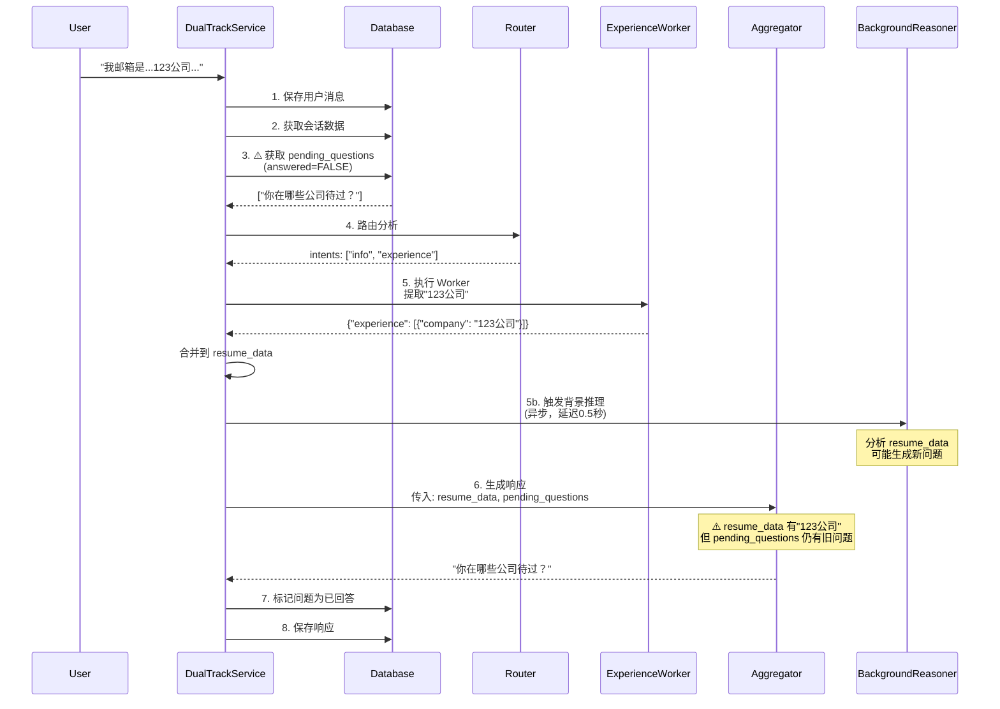

# Dual 模式重复询问公司信息问题分析

## 问题现象

**用户反馈场景：**
- 用户："我邮箱是 12345@123.com，是我毕业后一直在123公司工作的公司邮箱"
- AI："好的，张三，邮箱已经收集了。咱们继续聊聊你的工作经历吧，你在哪些公司待过？"
- 用户："我不是说了123公司吗"
- AI："好的，张三，你的工作经历我了解了。咱们继续聊聊你的工作经历吧，你在哪些公司待过？"（重复询问）

## 代码流程分析

### 当前执行流程（`dual_track_service.py`）



## 问题根源分析

### 问题 1：时序问题（主要问题）

**位置：** `src/service/dual_track_service.py:74-76`

```python
# Step 3: 从问题队列提取待提问的问题
pending_questions = await self.session_service.get_pending_questions(
    session_id, limit=1
)

# Step 5: 执行 Worker（提取公司信息）
await self._run_workers(intents, user_input, session_data, ...)

# Step 6: 生成响应（使用 Step 3 获取的旧问题）
response_text = await self._get_response_with_questions(
    session_data, intents, pending_questions, session_id
)
```

**问题描述：**
- `pending_questions` 在 Step 3 就被获取了，此时 Worker 还没有执行
- Worker 在 Step 5 提取了"123公司"信息，更新了 `session_data["resume_data"]`
- 但 Step 6 生成响应时，使用的还是 Step 3 获取的旧 `pending_questions`
- 导致即使用户已经提供了公司信息，系统仍然使用旧的待提问问题

**影响：**
- Aggregator 收到了包含"123公司"的 `resume_data`，但也收到了"你在哪些公司待过？"的 `pending_questions`
- 虽然 Aggregator 的 prompt 说"如果提供了用户输入，直接回应用户刚才说的话"，但没有明确指示如果数据已存在，应该跳过 `pending_questions` 中的问题

### 问题 2：Aggregator Prompt 缺乏明确指示

**位置：** `src/prompts/aggregator.md:38-42`

```markdown
### 注意事项：
- 如果提供了对话历史，优先基于用户最新输入进行响应
- 如果提供了用户输入，直接回应用户刚才说的话，不要机械确认
- 待补充的问题要自然地融入到对话中，一次最多提1-2个问题
- 推理洞察中的逻辑问题要在2-3轮后适当追问，但要温和、自然
```

**问题描述：**
- Prompt 没有明确说明：**如果 `resume_data` 中已经存在相关信息，应该跳过 `pending_questions` 中对应的问题**
- 例如：如果 `resume_data.experience` 中已有公司信息，就不应该再问"你在哪些公司待过？"

**影响：**
- LLM 可能会机械地使用 `pending_questions`，即使数据已经存在
- 没有明确的判断逻辑，导致重复提问

### 问题 3：背景推理可能生成重复问题

**位置：** `src/agents/background_reasoner.py:148-215`

**问题描述：**
- 背景推理是异步执行的，延迟 0.5 秒
- 它分析 `resume_data`，如果认为数据不完整，会生成新问题
- 例如：即使 Worker 提取了"123公司"，但如果缺少时间、职位等字段，背景推理可能仍然生成"你在哪些公司待过？"的问题

**影响：**
- 即使当前轮次用户已经回答了问题，背景推理可能在下一次用户输入时生成重复的问题
- 由于背景推理是异步的，可能在用户已经提供信息后仍然生成问题

### 问题 4：问题队列去重机制不足

**位置：** `src/agents/question_queue.py:108-135`

**问题描述：**
- `deduplicate()` 方法只按 `field` 去重，不检查数据是否已存在
- 例如：即使 `resume_data.experience` 中已有公司信息，只要 field="experience" 的问题还没有被标记为 `answered=TRUE`，就会一直存在

**影响：**
- 问题可能一直保留在队列中，直到被显式标记为已回答
- 没有基于数据状态的智能过滤

## 解决方案

### 方案 1：调整执行顺序（推荐，但需要配合其他方案）

**核心思路：** 将 `get_pending_questions` 移到 Worker 执行之后

**优点：**
- 确保获取的问题列表基于最新的数据状态
- 简单直接

**缺点：**
- 如果背景推理在 Worker 执行后异步生成了新问题，仍可能获取到过时的问题
- 不能完全解决问题 3 和问题 4

**实现位置：** `src/service/dual_track_service.py:74-100`

### 方案 2：在 Aggregator 调用前过滤问题（推荐）

**核心思路：** 在传递给 Aggregator 之前，过滤掉已被 `resume_data` 回答的问题

**优点：**
- 精确控制传递给 Aggregator 的问题列表
- 不依赖 LLM 的理解能力
- 可以同时解决多个问题

**缺点：**
- 需要实现数据检查逻辑
- 需要维护字段到问题的映射关系

**实现位置：** `src/service/dual_track_service.py` 新增方法 `_filter_answered_questions`

**过滤规则示例：**
- 如果 `resume_data.experience` 中有公司信息，且 `pending_questions` 中有 field="experience" 或 field="company" 的问题，且用户输入中提到了公司名 → 过滤掉该问题
- 如果 `resume_data.personal_info.name` 存在，且 `pending_questions` 中有 field="name" 的问题 → 过滤掉该问题
- 类似规则应用于其他字段（email, phone, education, skills）

### 方案 3：改进 Aggregator Prompt（辅助方案）

**核心思路：** 在 Aggregator prompt 中明确说明数据检查逻辑

**优点：**
- 让 LLM 自己判断是否应该跳过问题
- 不需要修改代码逻辑

**缺点：**
- 依赖 LLM 的理解和执行能力
- 可能不够可靠

**实现位置：** `src/prompts/aggregator.md`

**修改示例：**
```markdown
### 注意事项：
- **数据检查**：在提问前，先检查 `resume_data` 中是否已存在相关信息。如果已存在，跳过 `pending_questions` 中对应的问题。
  - 如果 `resume_data.experience` 中已有公司信息，不要问"你在哪些公司待过？"
  - 如果 `resume_data.personal_info.name` 已存在，不要问姓名相关的问题
  - 类似规则应用于其他字段
- 如果提供了对话历史，优先基于用户最新输入进行响应
- 如果提供了用户输入，直接回应用户刚才说的话，不要机械确认
- 待补充的问题要自然地融入到对话中，一次最多提1-2个问题
```

### 方案 4：改进背景推理的问题生成逻辑（长期方案）

**核心思路：** 背景推理在生成问题前，检查数据是否已存在

**优点：**
- 从源头减少重复问题的生成
- 提高问题队列的质量

**缺点：**
- 需要修改背景推理的逻辑
- 可能需要更复杂的数据检查

**实现位置：** `src/agents/background_reasoner.py` 或 `src/prompts/inference_worker.md`

## 推荐组合方案

**建议采用：方案 1 + 方案 2 + 方案 3**

1. **方案 1**：调整执行顺序，确保问题获取基于最新数据
2. **方案 2**：添加问题过滤逻辑，精确控制传递给 Aggregator 的问题
3. **方案 3**：改进 Aggregator prompt，作为双重保险

**优先级：**
1. **方案 2**（最重要）：直接解决问题，不依赖 LLM
2. **方案 1**（重要）：改善数据一致性
3. **方案 3**（辅助）：作为额外保障

## 注意事项

1. **数据提取的准确性**：过滤逻辑依赖于 Worker 能否正确提取用户输入中的信息
2. **字段映射关系**：需要建立 `pending_questions.field` 到 `resume_data` 字段的映射关系
3. **边界情况**：
   - 如果用户输入中提到公司，但 Worker 没有成功提取怎么办？
   - 如果数据不完整（只有公司名，没有时间、职位）怎么办？
   - 是否需要区分"完全回答"和"部分回答"？


