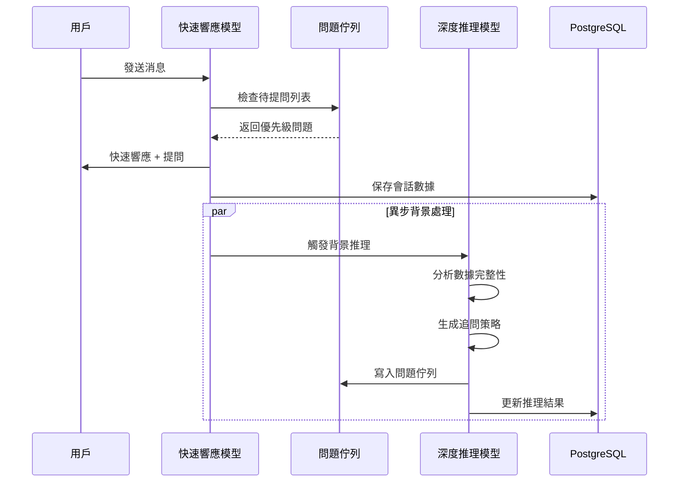

# 雙軌異步推理架構實現總結

**實現日期**: 2025-01-23  
**狀態**: ✅ 已完成

## 實現概述

已成功實現**雙軌異步推理架構（Dual-Track Async Reasoning Architecture）**，所有代碼與現有代碼物理隔離，便於學習和實驗。

## 已完成的工作

### 1. 目錄結構 ✅

創建了隔離的目錄結構：
```
src/dual_track/
├── __init__.py              # 模組初始化
├── question_queue.py        # 問題佇列管理器
├── db_session.py            # PostgreSQL 會話管理器
├── background_reasoner.py   # 背景推理服務
├── orchestrator_v2.py       # 雙軌架構編排器
├── factory.py               # 工廠類
├── api_endpoints.py         # API 端點
├── example_usage.py         # 使用示例
└── README.md                # 文檔
```

### 2. PostgreSQL 數據庫設置 ✅

#### Docker Compose
- ✅ 創建 `docker-compose.yml`
- ✅ 配置 PostgreSQL 15 容器
- ✅ 設置環境變量和端口映射
- ✅ 數據持久化配置

#### 數據庫腳本
- ✅ `scripts/init.sql` - 數據庫初始化 SQL
- ✅ `scripts/init_db.sh` - 初始化腳本
- ✅ `scripts/migrate_from_json.py` - 數據遷移腳本
- ✅ `scripts/reset_db.sh` - 重置數據庫腳本
- ✅ `scripts/backup_db.sh` - 備份腳本

#### 數據庫表結構
- ✅ `sessions` 表 - 存儲會話數據
- ✅ `question_queue` 表 - 存儲問題佇列
- ✅ `reasoning_results` 表 - 存儲推理結果
- ✅ 索引優化

### 3. 核心組件實現 ✅

#### 問題佇列管理器 (`QuestionQueue`)
- ✅ 問題的增刪改查
- ✅ 優先級排序
- ✅ 問題去重邏輯
- ✅ 已回答標記

#### 數據庫會話管理器 (`DBSessionManager`)
- ✅ 基於 asyncpg 的異步數據庫操作
- ✅ 連接池管理
- ✅ 會話數據的 CRUD 操作
- ✅ 問題佇列的數據庫操作

#### 背景推理服務 (`BackgroundReasoner`)
- ✅ 深度推理分析
- ✅ 問題生成
- ✅ 異步執行（不阻塞主流程）
- ✅ 狀態管理

#### 雙軌架構編排器 (`OrchestratorV2`)
- ✅ 整合快速響應和深度推理
- ✅ 問題佇列提取
- ✅ 異步觸發背景推理
- ✅ 響應生成

### 4. 配置更新 ✅

#### `pyproject.toml`
- ✅ 添加 `asyncpg>=0.29.0` 依賴

#### `src/config.py`
- ✅ 添加 `DATABASE_URL` 配置
- ✅ 添加 `DB_POOL_SIZE` 和 `DB_MAX_OVERFLOW` 配置
- ✅ 添加 `ENABLE_BACKGROUND_REASONING` 開關
- ✅ 添加 `MODEL_FAST_RESPONSE` 配置

#### `Makefile`
- ✅ 添加 `make db-up` - 啟動數據庫
- ✅ 添加 `make db-down` - 停止數據庫
- ✅ 添加 `make db-init` - 初始化數據庫
- ✅ 添加 `make db-migrate` - 數據遷移
- ✅ 添加 `make db-reset` - 重置數據庫
- ✅ 添加 `make db-logs` - 查看日誌

### 5. API 端點 ✅

- ✅ `POST /dual-track/chat` - 雙軌架構聊天端點
- ✅ `GET /dual-track/reasoning-status/{session_id}` - 查詢推理狀態

### 6. 文檔 ✅

- ✅ `src/dual_track/README.md` - 架構說明文檔
- ✅ `docs/requirements_20250123.md` - 需求文檔
- ✅ `src/dual_track/example_usage.py` - 使用示例

## 架構流程



## 使用方式

### 1. 啟動數據庫

```bash
# 啟動 PostgreSQL
make db-up

# 初始化數據庫
make db-init
```

### 2. 安裝依賴

```bash
make sync
```

### 3. 使用 API

```python
# 在 main.py 中註冊路由
from src.dual_track.api_endpoints import dual_track_router
app.include_router(dual_track_router)
```

### 4. 測試

```bash
# 運行示例
PYTHONPATH=. uv run python src/dual_track/example_usage.py
```

## 與現有代碼的區別

| 特性 | 現有架構 | 雙軌架構 |
|------|---------|---------|
| 存儲方式 | JSON 文件 | PostgreSQL |
| 推理方式 | 同步執行 | 異步執行 |
| 問題管理 | 簡單列表 | 結構化佇列 |
| 響應速度 | 依賴大模型 | 小模型快速響應 |
| 代碼位置 | `src/agent/` | `src/dual_track/` |

## 優勢

1. **響應速度快** - 小模型快速響應，用戶體驗流暢
2. **提問質量高** - 大模型深度分析，問題更精準
3. **資源優化** - 大模型異步執行，不阻塞主流程
4. **數據收集效率** - 問題佇列機制確保不遺漏關鍵信息
5. **可擴展性** - PostgreSQL 支持更好的數據管理和查詢

## 後續優化建議

1. **問題模板庫** - 預定義常見問題模板
2. **上下文感知** - 根據用戶回答動態調整問題
3. **多輪追問** - 針對模糊回答進行深度追問
4. **性能監控** - 添加推理時間和成功率監控
5. **錯誤處理** - 增強錯誤恢復機制

## 文件清單

### 核心代碼
- `src/dual_track/question_queue.py`
- `src/dual_track/db_session.py`
- `src/dual_track/background_reasoner.py`
- `src/dual_track/orchestrator_v2.py`
- `src/dual_track/factory.py`
- `src/dual_track/api_endpoints.py`

### 配置和腳本
- `docker-compose.yml`
- `scripts/init.sql`
- `scripts/init_db.sh`
- `scripts/migrate_from_json.py`
- `scripts/reset_db.sh`
- `scripts/backup_db.sh`

### 文檔
- `src/dual_track/README.md`
- `docs/requirements_20250123.md`
- `docs/dual_track_implementation_summary.md` (本文檔)

## 測試建議

1. **單元測試** - 測試問題佇列管理、去重邏輯
2. **集成測試** - 測試異步觸發、問題提取流程
3. **性能測試** - 測試響應時間、背景推理延遲
4. **數據庫測試** - 測試數據持久化和遷移

## 注意事項

1. 確保 Docker 已安裝並運行
2. 確保 PostgreSQL 容器正常啟動
3. 首次使用前需要執行 `make db-init`
4. 開發環境可以使用 `make db-reset` 重置數據庫

---

**實現完成！** 🎉

