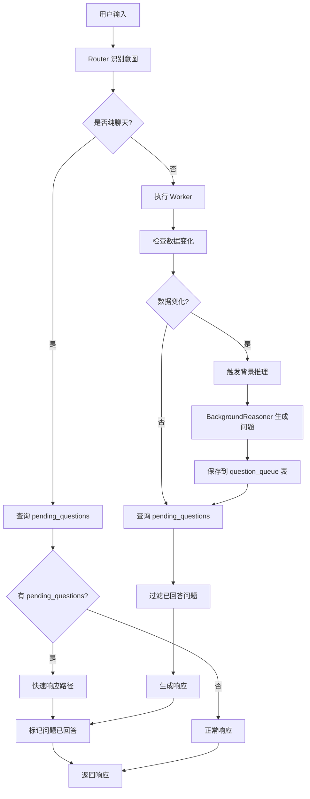
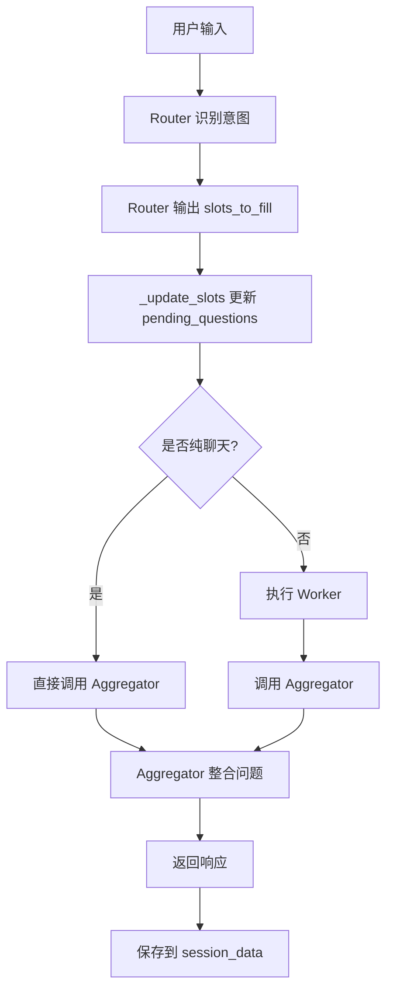

# pending_questions 流程文档

本文档详细说明 `pending_questions`（待提问问题）在 Dual-Track 和 Planner-Worker 两种架构中的完整流程。

## 一、Dual-Track 架构中的 pending_questions 流程

### 1.1 数据源

**存储位置**：`question_queue` 数据库表

**表结构**：
```sql
CREATE TABLE question_queue (
    id SERIAL PRIMARY KEY,
    session_id VARCHAR(255) NOT NULL,
    question_id VARCHAR(255) NOT NULL,
    content TEXT NOT NULL,
    priority INTEGER NOT NULL DEFAULT 99,
    field VARCHAR(100),
    reason TEXT,
    answered BOOLEAN DEFAULT FALSE,
    created_at TIMESTAMP DEFAULT CURRENT_TIMESTAMP,
    answered_at TIMESTAMP,
    UNIQUE(session_id, question_id)
);
```

### 1.2 流程节点



### 1.3 详细流程说明

#### 步骤 1：问题生成（BackgroundReasoner）

**位置**：`src/agents/background_reasoner.py` 第199-223行

**流程**：
1. 当 `resume_data` 发生变化时，触发背景推理
2. `BackgroundReasoner.analyze_and_generate_questions()` 分析简历数据
3. 生成结构化问题列表，包含：
   - `id`: 问题唯一标识
   - `content`: 问题内容
   - `field`: 相关字段（name, phone, email, experience, skills 等）
   - `reason`: 提问原因
   - `priority`: 优先级（数字越小优先级越高）

4. 通过 `QuestionQueue` 类管理问题队列
5. 调用 `save_question_queue()` 保存到数据库

**代码示例**：
```python
# 更新问题队列
question_queue_data = session_data.get("question_queue", {})
question_queue = QuestionQueue.from_dict(session_id, question_queue_data)

# 添加新问题
for q in result.get("questions", []):
    question_queue.add_question(
        question_id=q.get("id", f"q_{len(question_queue.questions)}"),
        content=q.get("content", ""),
        field=q.get("field"),
        reason=q.get("reason"),
        priority=q.get("priority")
    )

# 去重并保存
question_queue.deduplicate()
await self.session_service.save_question_queue(
    session_id, question_queue.to_dict()
)
```

#### 步骤 2：问题查询

**位置**：`src/service/session_service.py` 第625-647行

**SQL 查询**：
```sql
SELECT question_id, content, priority, field, reason
FROM question_queue
WHERE session_id = $1 AND answered = FALSE
ORDER BY priority ASC, created_at ASC
LIMIT $2
```

**返回格式**：
```python
[
    {
        "id": "question_id",
        "content": "问题内容",
        "priority": 1,
        "field": "experience",
        "reason": "缺少工作经历信息"
    }
]
```

#### 步骤 3：快速响应路径（纯聊天场景）

**位置**：`src/service/dual_track_service.py` 第83-98行

**触发条件**：
- `intents = ["chat"]`（只有一个聊天意图）
- 存在 `pending_questions`

**流程**：
1. 查询 `pending_questions`（limit=1）
2. 使用 `_fast_response()` 生成快速回复
3. 标记问题为已回答
4. 保存响应到历史
5. 返回响应

**代码示例**：
```python
if len(intents) == 1 and intents[0] == "chat":
    pending_questions = await self.session_service.get_pending_questions(
        session_id, limit=1
    )
    if pending_questions:
        response_text = await self._fast_response(
            session_data, pending_questions, user_input, session_id
        )
        # 标记已回答
        for q in pending_questions:
            await self.session_service.mark_question_answered(
                session_id, q["id"]
            )
```

#### 步骤 4：正常流程（有 Worker 执行）

**位置**：`src/service/dual_track_service.py` 第136-156行

**流程**：
1. Worker 执行后查询 `pending_questions`
2. `_filter_answered_questions()` 过滤已回答的问题
3. `_get_response_with_questions()` 生成响应（整合问题）
4. 标记已回答的问题

**代码示例**：
```python
# 从问题队列提取待提问的问题（在 Worker 执行之后）
pending_questions = await self.session_service.get_pending_questions(
    session_id, limit=1
)

# 过滤掉已经被当前轮次回答的问题
pending_questions = self._filter_answered_questions(
    pending_questions, session_data["resume_data"], user_input
)

# 生成响应（整合问题）
response_text = await self._get_response_with_questions(
    session_data, intents, pending_questions, session_id, user_input
)

# 标记已回答的问题
if pending_questions:
    for q in pending_questions:
        await self.session_service.mark_question_answered(
            session_id, q["id"]
        )
```

#### 步骤 5：问题过滤逻辑

**位置**：`src/service/dual_track_service.py` 第270-311行

**方法**：`_filter_answered_questions()`

**过滤规则**：
- **工作经历**：检查 `resume_data.experience` 是否有数据
- **个人信息**：检查 `resume_data.personal_info` 中的 `name`, `email`, `phone`
- **教育背景**：检查 `resume_data.education` 是否有学校信息
- **技能**：检查 `resume_data.skills` 是否有数据

**代码示例**：
```python
def _filter_answered_questions(
    self,
    pending_questions: List[Dict[str, Any]],
    resume_data: Dict[str, Any],
    user_input: str
) -> List[Dict[str, Any]]:
    """过滤掉已经被用户回答的问题"""
    filtered = []
    
    for q in pending_questions:
        field = q.get("field")
        question_content = q.get("content", "")
        
        # 检查工作经历
        if field in ["experience", "company"] or "工作" in question_content:
            experience = resume_data.get("experience", [])
            if experience and len(experience) > 0:
                continue  # 跳过已回答的问题
        
        # 检查个人信息
        elif field in ["name"]:
            personal_info = resume_data.get("personal_info", {})
            if personal_info.get("name"):
                continue
        
        # ... 其他字段检查
        
        filtered.append(q)  # 保留未回答的问题
    
    return filtered
```

#### 步骤 6：传递给 Aggregator

**位置**：`src/service/dual_track_service.py` 第401-404行

**流程**：
1. `_get_response_with_questions()` 调用 `Aggregator.aggregate()`
2. 将 `pending_questions` 转换为字符串列表传入
3. Aggregator 将问题整合到响应中

**代码示例**：
```python
response = await self.aggregator.aggregate(
    session_data,
    ", ".join(intents),
    pending_questions=[q["content"] for q in pending_questions] if pending_questions else [],
    session_id=session_id,
    user_input=user_input,
    conversation_history=conversation_history,
    on_sse_event=on_sse_event
)
```

## 二、Planner-Worker 架构中的 pending_questions 流程

### 2.1 数据源

**存储位置**：`sessions` 表的 `pending_questions` JSONB 字段

**数据结构**：
```json
{
  "pending_questions": ["name", "phone", "email", "school"]
}
```

### 2.2 流程节点



### 2.3 详细流程说明

#### 步骤 1：问题生成（Router）

**位置**：`src/prompts/router.md` 第15行

**流程**：
1. Router 分析用户输入和当前简历数据
2. 识别缺失的字段
3. 输出 `slots_to_fill` 字段列表

**Router 输出格式**：
```json
{
  "intents": ["info", "chat"],
  "reason": "用户提供了姓名，但缺少联系方式",
  "slots_to_fill": ["phone", "email"]
}
```

#### 步骤 2：更新 pending_questions

**位置**：`src/service/planner_worker_service.py` 第273-286行

**方法**：`_update_slots()`

**流程**：
1. 从 Router 结果中提取 `slots_to_fill`
2. 添加到 `session_data.pending_questions`
3. 按优先级排序

**代码示例**：
```python
def _update_slots(self, route_result: Dict[str, Any], session_data: Dict[str, Any]):
    """更新槽位状态"""
    slots = route_result.get("slots_to_fill", [])
    if not slots:
        return
    
    pending = session_data.setdefault("pending_questions", [])
    priority = {"name": 1, "phone": 2, "email": 3, "school": 4, "major": 5, "degree": 6}
    
    for s in slots:
        if s not in pending:
            pending.append(s)
    
    pending.sort(key=lambda x: priority.get(x.lower(), 99))
```

#### 步骤 3：传递给 Aggregator

**位置**：`src/service/planner_worker_service.py` 第243-249行

**流程**：
1. 从 `session_data` 读取 `pending_questions`
2. 传递给 `Aggregator.aggregate()`
3. Aggregator 将问题整合到响应中

**代码示例**：
```python
response_text = await self.aggregator.aggregate(
    session_data, ", ".join(intents),
    pending_questions=session_data.get("pending_questions", []),
    session_id=session_id,
    user_input=user_input,
    on_sse_event=on_sse_event
)
```

#### 步骤 4：Aggregator 处理

**位置**：`src/agents/aggregator.py` 第75行

**流程**：
1. 接收 `pending_questions`（字符串列表或 None）
2. 序列化为 JSON 字符串
3. 传入 prompt 模板的 `pending_questions` 变量

**代码示例**：
```python
kwargs = {
    "resume_data": json.dumps(session_data.get('resume_data', {}), ensure_ascii=False),
    "inference_insights": json.dumps(session_data.get('inference_insights', []), ensure_ascii=False),
    "last_intent": last_intent,
    "pending_questions": json.dumps(
        pending_questions if pending_questions is not None 
        else session_data.get('pending_questions', []), 
        ensure_ascii=False
    ),
    "conversation_history": history_text if history_text else ""
}
```

#### 步骤 5：返回响应

**位置**：`src/service/planner_worker_service.py` 第261-271行

**响应格式**：
```python
{
    "status": "success",
    "response": response_text,
    "session_id": session_id,
    "pending_questions": session_data.get("pending_questions", []),
    "agent_type": "planner_worker",
    "debug": {
        "intents": intents,
        "duration": self._calculate_total_duration(intents)
    }
}
```

## 三、关键差异对比

| 特性 | Dual-Track | Planner-Worker |
|------|-----------|----------------|
| **数据存储** | `question_queue` 表 | `sessions.pending_questions` JSONB 字段 |
| **问题来源** | BackgroundReasoner 分析生成 | Router 的 slots_to_fill |
| **问题格式** | 结构化（id, content, priority, field, reason） | 简单列表（字符串数组） |
| **查询方式** | SQL 查询（按优先级排序） | 直接从 session_data 读取 |
| **标记已回答** | `mark_question_answered()` 更新数据库 | 无显式标记机制 |
| **过滤逻辑** | `_filter_answered_questions()` 检查 resume_data | 无过滤逻辑 |
| **问题管理** | QuestionQueue 类管理优先级和去重 | 简单的列表追加和排序 |
| **快速响应** | 支持快速响应路径（纯聊天场景） | 无快速响应路径 |

## 四、关键代码位置

### Dual-Track 架构

- **问题生成**：`src/agents/background_reasoner.py:199-223`
- **问题查询**：`src/service/session_service.py:625-647`
- **快速响应**：`src/service/dual_track_service.py:83-98`
- **正常流程**：`src/service/dual_track_service.py:136-156`
- **问题过滤**：`src/service/dual_track_service.py:270-311`
- **传递给 Aggregator**：`src/service/dual_track_service.py:401-404`

### Planner-Worker 架构

- **问题生成**：`src/prompts/router.md:15`（Router prompt）
- **更新 pending_questions**：`src/service/planner_worker_service.py:273-286`
- **传递给 Aggregator**：`src/service/planner_worker_service.py:243-249`
- **Aggregator 处理**：`src/agents/aggregator.py:75`

### 共享组件

- **QuestionQueue 类**：`src/agents/question_queue.py`
- **Aggregator**：`src/agents/aggregator.py`
- **SessionService**：`src/service/session_service.py`

## 五、数据流转图

### Dual-Track 架构数据流转

```
BackgroundReasoner
    ↓ (生成问题)
QuestionQueue 类
    ↓ (保存)
question_queue 表
    ↓ (查询)
SessionService.get_pending_questions()
    ↓ (过滤)
_filter_answered_questions()
    ↓ (传递)
Aggregator.aggregate()
    ↓ (整合)
用户响应
```

### Planner-Worker 架构数据流转

```
Router
    ↓ (识别缺失字段)
slots_to_fill
    ↓ (更新)
session_data.pending_questions
    ↓ (传递)
Aggregator.aggregate()
    ↓ (整合)
用户响应
```

## 六、注意事项

1. **Dual-Track 架构**：
   - 问题在 Worker 执行**之后**查询，确保基于最新数据状态
   - 支持问题过滤，避免重复提问已回答的问题
   - 使用数据库表存储，支持复杂查询和优先级排序

2. **Planner-Worker 架构**：
   - 问题在 Router 阶段就生成，基于当前数据状态
   - 无过滤机制，可能重复提问
   - 使用 JSONB 字段存储，简单但功能有限

3. **问题格式差异**：
   - Dual-Track 使用结构化问题对象，包含更多元数据
   - Planner-Worker 使用简单字符串列表，仅包含字段名

4. **性能考虑**：
   - Dual-Track 的数据库查询可能比 Planner-Worker 的内存读取稍慢
   - 但 Dual-Track 支持更复杂的问题管理和过滤逻辑

